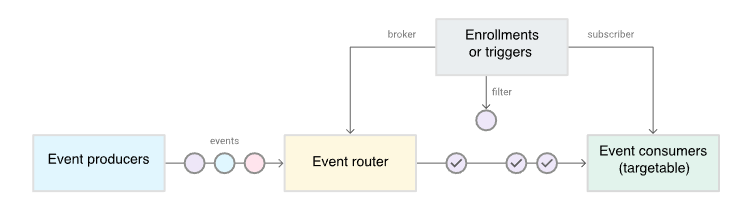
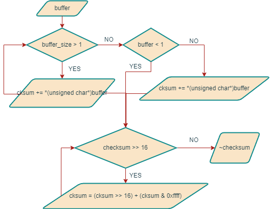
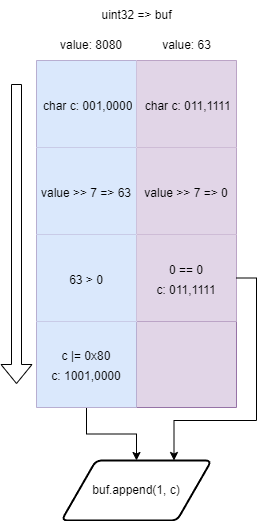
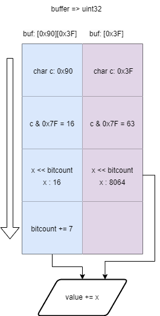
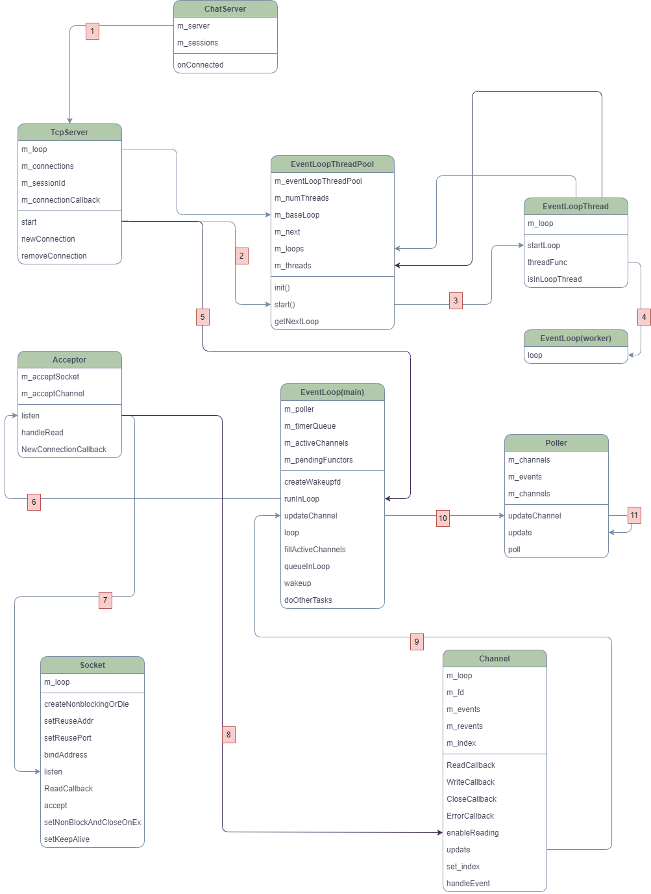
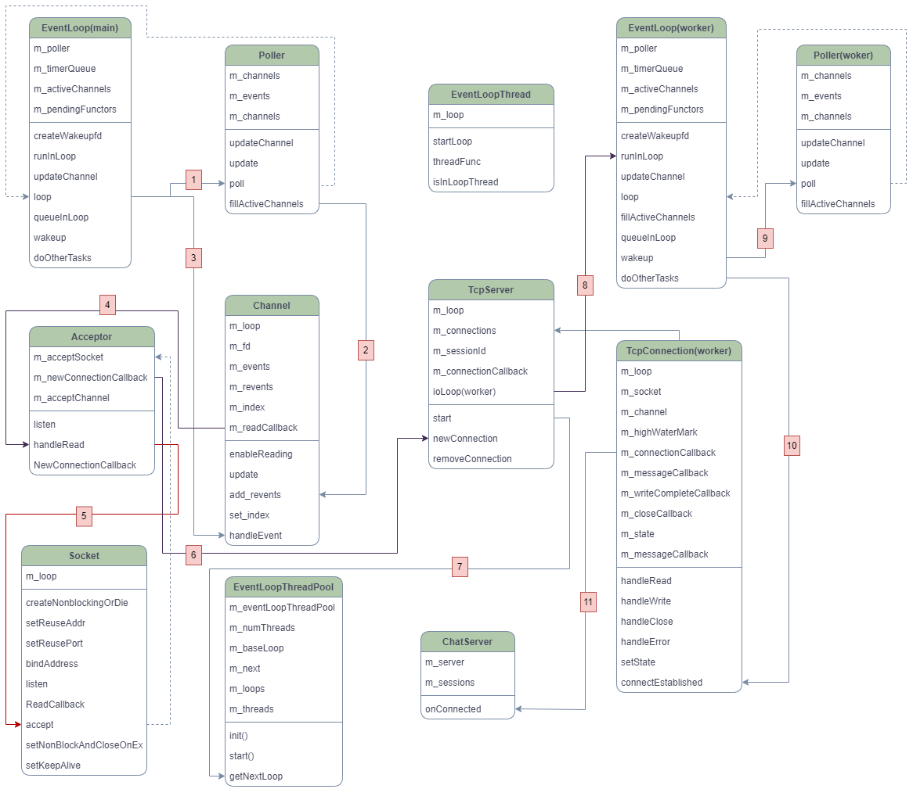
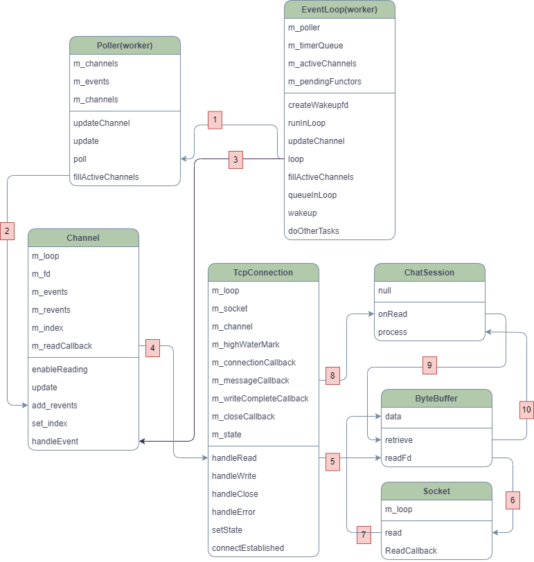
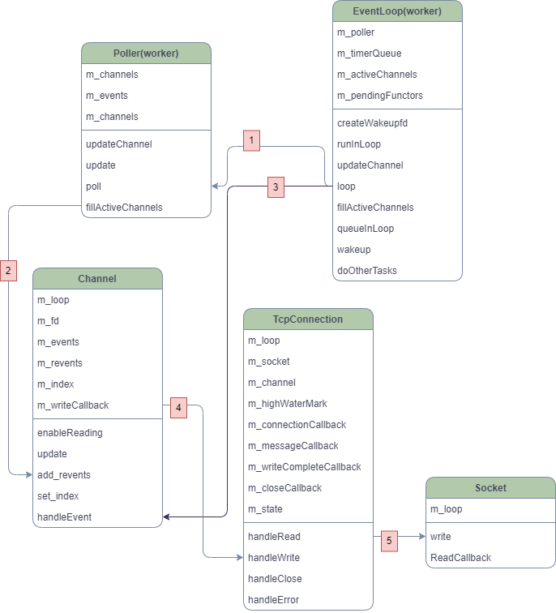
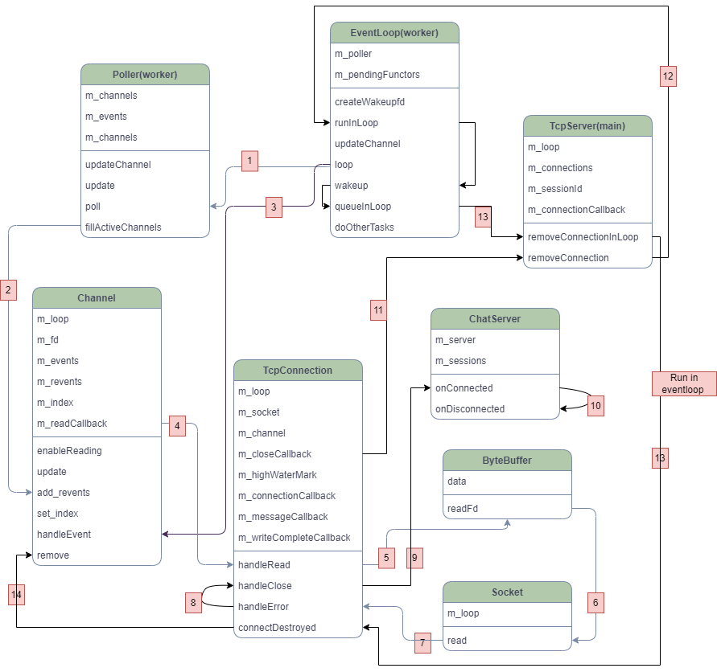

# flamingo Server 长文梳理，及优秀编程细节整理

## 前言

flamingo Server 是[开源即时通讯软件的Flamingo IM]([balloonwj/flamingo: flamingo 一款高性能轻量级开源即时通讯软件](https://github.com/balloonwj/flamingo))中的服务端。该服务端采用了当下主流服务器框架，Reactor 模式+线程池模式， 由主reactor管理连接及任务分发，其余reactor负责接受任务并处理任务。我们也叫其为one thread one loop模式。

## flamingo Server概述

### 何为Reactor 模式+线程池模式

开始之前我们先要介绍，Reactor模式主要是为了解决什么问题？

#### 基于线程的架构

当我们接收到一个连接请求时，我们就为它创建一个线程。如果某一时刻同时有多个请求，那么服务器就要为每个请求分别创建线程。

假设在ubuntu机器中，一个线程默认需要8M的内存，如果此时有1000个请求，那么我们将有8个G的内存仅用于线程，可见这并不是一个合理的架构。

我们可以尝试对这些请求进行整理归纳，由此可引出事件驱动型架构。

#### 事件驱动型架构

事件驱动型架构本质是一个软件设计模式。事件的生产者，会产生许多不同的事件，这时候我们需要一个事件监听装置，这个装置我们我们称其为事件路由器，它不需要知道事件的内容是什么，只需要知道事件的类型，然后根据事件的类型将其分发给其他服务接收处理，再分发之前，我们也可以对事件进行筛选和预处理。这种模式有效的降低了各个模块的耦合度，且更利于拓展和维护。



Reactor模式就是基于此架构。

##### Reactor模式

- 单线程模式：当有客户端请求连接时，服务器会创建一个线程来接收连接，线程中会使用io复用函数监控多个连接请求，然后分发给不同handler（通常都是回调函数）。在一个线程中，reactor可以处理连接，数据处理等全套工作。现在非常热门的redis，就是如此架构模式。

- 线程池模式：当有客户端连接时，服务器会创建一个线程来接受连接同时创建一个线程池，并使用io复用函数监控多个连接请求，然后从线程池中提取线程给每个handler去处理数据。如今redis的多线程模式就是这种架构。

- 多线程模式:  我们会创建多个reactor模式的线程。单个客户端连接时，服务器会创建一个rector模式线程（主），来处理连接，同时创建一个reactor模式线程（工作线程）的线程池，然后主线程会将接收到的连接，分配到工作线程上，由工作线程负责连接后的数据处理等工作。这就是今天要讲的flamingo server的架构。

  

### 模块介绍（选了主要的类和类中部分相对重要的函数介绍）

#### 基础模块

- Socket 类：封装了socket的操作
  - 设置阻塞/非阻塞模式
  - 设置是否复用ip地址/端口
  - bind/listen/accpet/send/recv/close/shutdown

- Channel类：负责管理fd(file description)的网络事件, 并绑定事件handler

  - 从属关系：Channel -> IO复用函数 -> EventLoop 
  - 一个fd对应一个Channel

- Poller类：管理Channel。纯虚类，派生了SelectPoller类，PollPoller类，EpollPoller类

  - SelectPoller类：windows/linux select
    - select第一个参数 maxfd要+1，因为它是表示数量，但fd是从0开始的
    - 第四个参数exceptfd，是带外事件的意思，一般是紧急事件
  - PollPoller类
  - EpollPoller类

- ByteBuffer 类：以块为单位管理读写缓冲区。该模块借鉴了Netty.buffer.ChannelBuffer

  > ```cpp
  > /// +-------------------+------------------+------------------+
  > /// | prependable bytes |  readable bytes  |  writable bytes  |
  > /// |                   |     (CONTENT)    |                  |
  > /// +-------------------+------------------+------------------+
  > /// |                   |                  |                  |
  > /// 0      <=      readerIndex   <=   writerIndex    <=     size
  > ```

  - prependable bytes 是为了减少频繁的内存拷贝动作，该区域可以插入一些临时信息，例如需要临时传递标头信息，这样可以避免缓冲区重新分配内存
  - readerIndex/writerIndex：实现了**读写分离**机制，使得数据可以同时进行读取和写入的操作
  - makeSpace： 可以动态拓展缓冲区
    - writableBytes 和 prependableBytes 的空间总和不足以容纳新的数据，它会直接扩展缓冲区
    - 如果有足够的预留空间，makeSpace会将现有的可读数据向前移动以消除已读数据所占的空间，腾出新的空间（**零拷贝**）。避免新增内存块时而产生的拷贝动作
  - ensureWritableBytes： 按需拓展可写空间
  - m_buffer: 利用了std::vector的动态拓展特性，可以进行高效的内存分配和释放
  - ByteBuffer::readFd：封装了系统api read函数，创建extrabuf空间，用来辅助接收过大的数据，如果写入buffer的长度超过writable bytes：
    - windows：全部写入extrabuf
    - linux：利用iovec, 将超过writable bytes的数据写入到extrabuf
  - appendIntXX: 处理整型变量，都是以大端模式进行存储

- Timer类：定时器，在一定的时间点或这时间间隔后执行某个任务(callback)

  - 主要属性：保质期：m_expiration，需要重复执行的次数：m_repeatCount， 是否为取消状态：m_canceled

- Timestamp：时间戳，封装了std::chrono，获取当前时间

- EventLoop类：reactor模式核心实现

  - 基本逻辑： loop函数

    ```
    Wakeup();
    
    while(//退出条件){
    	//1. 定时器
    	
    	//2. IO复用函数，查询等待fd上的事件
    	
    	//3. 处理事件
    	
    	//4. doOtherTasks //任务队列，异步执行
    	
    	//5. Other task //同步执行
    }
    ```

  - Wakeup：但我们只要处理非事件任务时，可以通过向fd发送一个字节的数据来唤醒IO复用函数，让loop正常执行

    - 利用管道的机制，向wakeupfd写事件，唤醒eventloop

    - Windows：模拟一个小型本机客户端，绑定回环地址(指本机地址，本机send，本机recv）和任意端口

    - Linux：可以直接使用linux现成的工具

      - eventfd

      - socketpair
    
        ```cpp
        int sv[2];  // 用于存储套接字对
        socketpair(AF_UNIX, SOCK_STREAM, 0, sv);
        
        //绑定到IO复用函数
        select(sv[0] + 1, &read_fds, NULL, NULL, &timeout);
        
        //通过sv[1]写事件，触发sv[0]读事件
        write(sv[1], msg, strlen(msg));
        ```
    
  - 定时器相关的成员函数：RunAt，RunAfter, RunEvery

  - runInLoop: 判断当前loop是否在所属线程，如果是，执行任务，反之，调用queueInLoop

    ```cpp
    void EventLoop::runInLoop(const Functor& cb)
    {
        if (isInLoopThread())
        {
            cb();
        }
        else
        {
            queueInLoop(cb);
        }
    }
    ```
    
  - queueInLoop：将任务存储在任务队列，如果不是在当前所属线程或者当前loop正在执行other task，立刻唤醒指定线程的Eventloop来处理

    ```cpp
    void EventLoop::runInLoop(const Functor& cb)
    {
        if (isInLoopThread())
        {
            cb();
        }
        else
        {
            queueInLoop(cb);
        }
    }
    ```


- ProtocolStream类 : 二进制数据流的读取和写入，以及数据的编码与校验
  - checksum：校验和，检查数据包的完整性，或是否被篡改
    1. 累加buffer中的数值到cksum，检查剩余buffer的长度

    2. 默认数据的长度是2，如果出现还剩1字节，将其转为char型再累加

    3. 将cksum的高位与低16位相加，直至只有16位

    4. 取反返回

       

  - write7BitEncoded：将整型数据压缩，并分包成一个个的字节
    1. 提取数据的低7位，转化为8位无符号单字节

    2. 右移7位

    3. 如果此时还是大于0，即表示高位还有值，设置高位为1（此为标志位，高位还有数据），将已经转化后的8位无符号单字节存入buf

    4. 然后回到1，继续执行，直到没有高位

       

  - read7BitEncoded：将压缩后的字节解压，打包成整型
    1. 从buffer中提取第一个字节

    2. 右移已经处理过的位数，累加到value中

    3. 检查第一个字节的高位是否为1，如果是，回到第一步继续执行

       

  - BinaryStreamWriter::WriteCString：将C字符换写入二进制流中
    1. 写入长度，由write7BitEncoded压缩
    2. 写入字符串

  - BinaryStreamReader::ReadCString：
    1. 解压得到字符串长度
    2. 若协议中的长度大于实际长度，该数据不全，解析失败
    3. 定位到实际数据位置
    4. 边界判断，检查是否有足够的数据供读取，如果没有，解析失败
    5. 将数据拷贝缓存区中

- ZlibUtil类：封装zlib库的接口

#### 中间模块

- TimeQueue:  使用队列管理定时器。数据结构是std::set

  - 时间器执行逻辑：
    1. 通过TimeStamp获取当前时间
    2. 遍历队列
       1. 如果当前时间器没有过期
       2. 执行
       3. 根据时间器执行次数，保留或移除

  - 时间器的管理操作：add，remove，cancel，是放在EventLoop中执行的

- EventLoopThread 类：为EvenLoop创建线程，这里使用了条件变量，来实现同步机制

  - EventLoopThread::threadFunc（生产者）：从handler中拿取EventLoop,然后用条件变量通知负责创建的函数startLoop
  - EventLoopThread::startLoop(消费者)：等待通知，为Eventloop创建线程

#### 角色模块

- EventLoopThreadPool 类：管理多个EventLoopThread和EventLoop，并执行分配任务

- Acceptor类：负责监听连接和处理连接，并注册读事件到IO复用函数

- TCPConnection类：工作线程基本单位，处理连接成功后的事件，装包解包

- TCPServer类：管理线程池和Acceptor
  - newConnection: 创建一个TCPConnection
    1. 从线程池中取出eventloop 
    2. 创建一个TCPConnection与之绑定，并设置事件handler
    3. 唤醒evenloop，doOtherTask -> TcpConnection::connectEstablished
  
- ChatSession类：解包/装包，接收/发送

  - onRead: 读取缓冲区中的内容，采用的是水平模式

    1. 判断收到的数据是否够一个包头大小，while循环等待缓冲区

    2. 取包头信息

    3. 检查压缩位，有无压缩

       1. 检查压缩后的长度（若有压缩）和压缩前的长度是否合法，非法立即断开连接
       2. 检查是否收到了一个完整包
       3. 提取压缩后的数据拷贝到缓冲区中
       4. 提取数据包中数据

       


### 连接流程（call stack）

#### 1. 开启侦听



#### 2. 建立连接



#### 3. 读事件处理



#### 4. 写事件处理



#### 5. 断开连接



## 编程技巧

- socket文件中，使用了namepace sockets表明以下的函数是对socket的操作，不属于socket类，增加了代码的易读性

- 为了能够更好的实现资源分配，项目中频繁只使用状态标签，表示当前的执行状态，例如：

  - EventLoop::loop()中的m_looping，m_quit，m_eventHandling, m_doingOtherTasks

- 在给字符串赋值时，使用snprinf（C函数），可以指定缓冲区大小（包括终止符`\n`），输出目标字符串，防止缓冲区溢出。返回值是当前需要被写入的字符串的长度（不包含终止符\n）。

  ```cpp
  #include <cstdio>
  #include <cstdlib>
  
  int main() {
      const char *message = "hello world!";
      int size = snprintf(nullptr, 0, "%s", message) + 1; // 计算所需大小
      char *buffer = (char *)malloc(size);
  
      if (buffer) {
          snprintf(buffer, size, "%s", message);
          printf("Buffer: %s\n", buffer);
          free(buffer);
      }
  
      return 0;
  }
  ```

- 在EventLoop::doOtherTasks()有个非常巧妙的设计

  ```cpp
  void EventLoop::doOtherTasks()
  {
      std::vector<Functor> functors;
      m_doingOtherTasks = true;
  	
      /*从任务队列获取任务时，直接将整个队列拷贝到一个临时队列中处理，
        避免多线程同步的情况下，阻塞较长时间来遍历和执行任务，
        降低了锁定的粒度*/
      {
          std::unique_lock<std::mutex> lock(m_mutex);
          functors.swap(m_pendingFunctors);
      }
  
      for (size_t i = 0; i < functors.size(); ++i)
      {
          functors[i]();
      }
  
      m_doingOtherTasks = false;
  }
  ```

- 在SelectPoller::poll 中，如果IO复用函数接收到的事件等于存储容器的大小需要手动扩容

  - 预防高负载的情况

  - 2倍的扩容策略，可以减少扩容次数

  - 为epoll_wait提供足够的缓冲区,避免内存越界问题

    ```
    if (numEvents > 0)
    {
        //LOG_TRACE << numEvents << " events happended";
        fillActiveChannels(numEvents, activeChannels, readfds, writefds);
        if (static_cast<size_t>(numEvents) == m_events.size())
        {
            m_events.resize(m_events.size() * 2);
        }
    }
    ```

- 协议头中存在一个设计，消息包头中不仅存储了包体压缩后的大小，也存储了压缩前的大小，为什么需要压缩前的大小呢

  - 可以根据压缩前的大小提前分配内存块
  - 限制数据大小，避免出现压缩后的数据很小，压缩前的数据过大，造成其占用过多的内存资源（防止恶意攻击）


```
//协议头
struct chat_msg_header
{
    char     compressflag;     //压缩标志，如果为1，则启用压缩，反之不启用压缩
    int32_t  originsize;       //包体压缩前大小
    int32_t  compresssize;     //包体压缩后大小
    char     reserved[1=6];
};
```

- 在构造Tcpconnection时，设置了长连接 的属性，可以满足通讯软件持续聊天的条件

  ```
  setsockopt(m_sockfd, SOL_SOCKET, SO_KEEPALIVE, &optval, static_cast<socklen_t>(sizeof optval));
  ```

- 在数据发送阶段TcpConnection::sendInLoop

  - 使用了高水位的机制，来进行流量控制，如果发生了缓冲区数据积压的情况，使用callback通知应用层处理

    ```cpp
    size_t oldLen = m_outputBuffer.readableBytes();
    if (oldLen + remaining >= m_highWaterMark
        && oldLen < m_highWaterMark
        && m_highWaterMarkCallback)
    {
        m_loop->queueInLoop(std::bind(m_highWaterMarkCallback, shared_from_this(), oldLen + remaining));
    }
    ```

  - 如果数据数据没有发送完，将剩余数据加入到输出缓冲区，继续触发写事件来发送

    ```cpp
    m_outputBuffer.append(static_cast<const char*>(data) + nwrote, remaining);
    if (!m_channel->isWriting())
    {
        m_channel->enableWriting();
    }
    ```

    

- ChatSession中也设计了一个心跳包机制，协议层面设置了长连接，应用层面每隔15秒钟会检查是否有掉线的情况

  ```cpp
  void ChatSession::enableHearbeatCheck()
  {
      std::shared_ptr<TcpConnection> conn = getConnectionPtr();
      if (conn)
      {
          //每15秒钟检测一下是否有掉线现象
          m_checkOnlineTimerId = conn->getLoop()->runEvery(15000000, std::bind(&ChatSession::checkHeartbeat, this, conn));
      }
  }
  
  void ChatSession::checkHeartbeat(const std::shared_ptr<TcpConnection>& conn)
  {
      if (!conn)
          return;
  	
      if (time(NULL) - m_lastPackageTime < MAX_NO_PACKAGE_INTERVAL)
          return;
  	//距离上次收发包的时间间隔小于设定的最大时间间隔，就断开连接
      conn->forceClose();
  }
  ```

  

## 优化想法

- 在eventloop中，开源作者想要在处理事件前将channel根据优先级排序

  ```cpp
  // TODO sort channel by priority
  //std::vector<Channel*> m_activeChannels
  m_eventHandling = true;
  for (const auto& it : m_activeChannels)
  {
      currentActiveChannel_ = it;
      currentActiveChannel_->handleEvent(m_pollReturnTime);
  }
  ```

  可以将尝试在socket对象中添成员变量表示优先级flag，使用std::map来存储channel对象，存储单元(m_socket::getpirotiy(), std::list<channel*>)，处理事件时可以根据优先级处理。

-  项目中，使用配置文件来存储相关的配置信息：

  ```
  #client listener
  listenip=0.0.0.0
  listenport=20000
  
  #monitor listener
  monitorlistenip=0.0.0.0
  monitorlistenport=8888
  monitortoken=123
  
  #http listener
  httplistenip=0.0.0.0
  httplistenport=12345
  
  logfiledir=logs/
  logfilename=chatserver
  logbinarypackage=0
  
  #mysql config
  dbserver=101.37.25.166
  dbuser=root
  dbpassword=123456
  dbname=flamingo
  ```

  在server启动时到关闭，配置文件只会被加载一次。如果在server启动的时候，临时修改配置或者出现了bug但不影响运行打印详细日志的时候，就需要重启server。初步思路：

  1. 设置定时器，监控文件变动
  2. 将读配置文件的动作放入任务队列中
  3. 配置文件篡改异常，取消更改，并关闭定时器
  4. 查看需要更改的配置，一 一放入任务队列中
  5. 应用配置时，需要使用线程同步机制，保证线程安全


